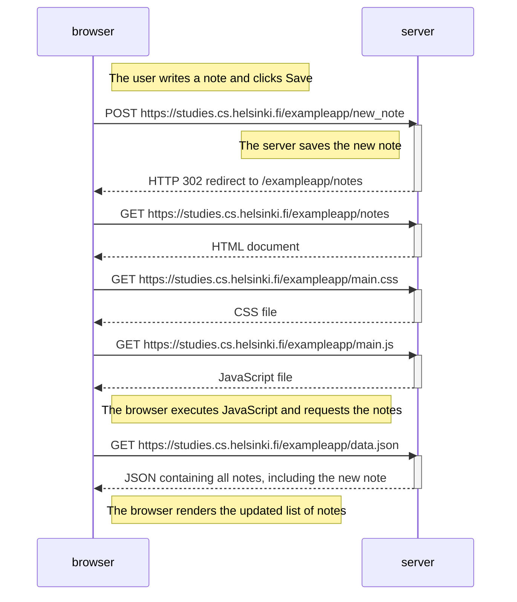
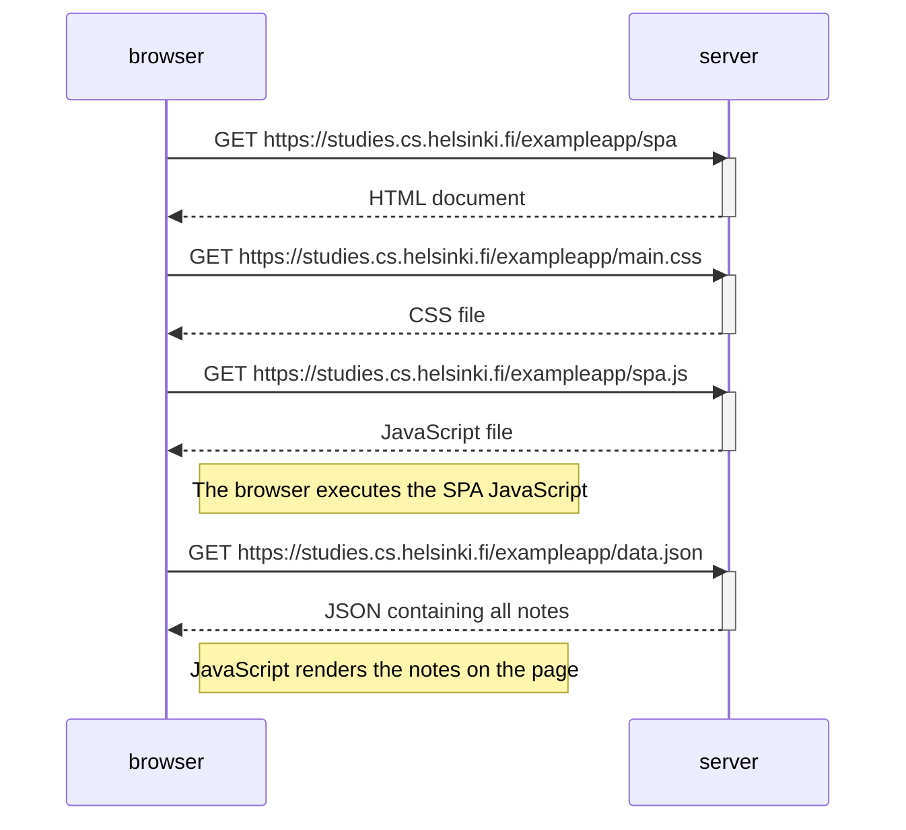

# Full Stack Open — Part 0

Solutions for exercises 0.4–0.6 of Full Stack Open.

Exercises 0.1–0.3 are reading exercises and do not require a GitHub submission.

## 0.4: New note diagram

When the user writes a note and clicks **Save**, the browser sends the form data to the server using an HTTP POST request. The server saves the note and redirects the browser back to the notes page. The browser then reloads the HTML, CSS, JavaScript, and note data.



## 0.5: Single-page app diagram

When the user opens the SPA, the browser downloads the HTML, CSS, and SPA JavaScript. The JavaScript then requests the notes as JSON and renders them on the page.



## 0.6: New note in Single-page app diagram

In the SPA, JavaScript prevents the form's default submission. It adds the new note to the page and sends it to the server as JSON. The browser does not reload or redirect.

```mermaid
sequenceDiagram
    participant browser
    participant server

    Note right of browser: The user writes a note and clicks Save
    Note right of browser: JavaScript prevents the default form submission
    Note right of browser: JavaScript adds the note to the list and redraws the page

    browser->>server: POST https://studies.cs.helsinki.fi/exampleapp/new_note_spa with JSON note
    activate server
    Note left of server: The server saves the new note
    server-->>browser: HTTP 201 Created
    deactivate server

    Note right of browser: The browser stays on the same page; no reload occurs
```

